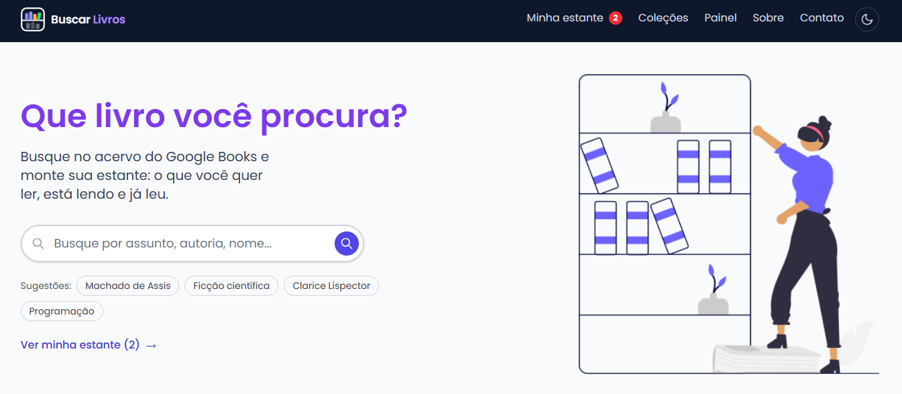

# Buscar Livros



## 📖 Sobre

**Buscar Livros** é uma estante virtual desenvolvida com React e TypeScript. Os usuários pesquisam no acervo do Google Books, guardam os livros que querem ler, acompanham a leitura página a página e organizam tudo em estantes, tags e coleções, com um painel que mostra metas, ritmo e estatísticas ao longo do ano.

O projeto conta com tema claro e escuro, filtros que vivem na URL (links compartilháveis e histórico do navegador funcionando), atualizações otimistas com "Desfazer", persistência local para abrir a estante instantaneamente e carregamento sob demanda de cada tela.

---

## ✨ Funcionalidades

- 🔎 **Busca no Google Books**
  - Busca por texto livre com filtros por título, autoria, assunto, ISBN, idioma, disponibilidade (e-books, gratuitos ou pagos) e tipo (livros ou revistas).
  - Ordenação por relevância ou mais recentes, paginação com 10, 20 ou 40 itens por página e visualização em grade ou lista.
  - Toda a busca fica na URL (`/?q=tolkien&idioma=pt&page=2`): o link é compartilhável, o F5 preserva a seleção e o botão de voltar desfaz a escolha.
  - Sugestões de títulos reais enquanto se digita, histórico de buscas recentes e chips de sugestão na tela inicial.
  - Vitrine de recomendações na Home derivada dos autores e categorias da sua própria estante.
  - Os resultados indicam quais livros já estão na estante e permitem adicioná-los direto do card.

- 📕 **Página do Livro**
  - Capa em alta resolução, descrição expansível e ficha técnica com ISBN, idioma, editora, avaliação, formatos digitais (EPUB/PDF), preço e links de prévia e compra.
  - Livros relacionados da mesma autoria e da mesma categoria.
  - Compartilhamento nativo (Web Share API) com fallback para cópia do link.
  - Resumo da leitura logo abaixo do título para quem já tem o livro na estante.

- 📚 **Estante Pessoal**
  - Três status de leitura: **Quero ler**, **Lendo** e **Lido**, com datas de início e conclusão preenchidas automaticamente.
  - Progresso por página com histórico de marcações, páginas lidas por sessão, ritmo e estimativa de término.
  - Nota de 1 a 5 estrelas, anotações pessoais e tags livres.
  - Filtros por aba, ordenação (recentes, título, autoria, nota, progresso, conclusão...), busca textual, tags, nota mínima e "com anotações", todos na URL.
  - Seleção múltipla com ações em lote: mudar status, adicionar ou remover tags e estantes, remover da estante.
  - Remoção com "Desfazer" no toast e atualizações otimistas com rollback em caso de falha.

- 🗂️ **Estantes Personalizadas**
  - Crie estantes próprias com nome, ícone e cor ("Emprestados", "Para o clube do livro"...).
  - Um livro pode estar em várias estantes personalizadas sem perder o status de leitura.

- 📦 **Coleções**
  - Agrupamentos ordenados de livros, como sagas e trilogias, com reordenação dos volumes.
  - Progresso da coleção (lidos, lendo e faltantes) e aviso quando um volume saiu da estante.

- 📊 **Painel de Leitura**
  - Meta anual de livros com seletor de ano e barra de progresso.
  - Totais por estante, páginas lidas, média de notas e livros concluídos no ano.
  - Gráfico mensal de livros concluídos e de páginas lidas, com média e projeção para o fim do ano.
  - Autores, categorias e tags mais presentes, cada um com link para a estante já filtrada.

- 🌗 **Tema, Offline e Experiência**
  - Tema claro e escuro aplicado antes da primeira pintura, sem flash, respeitando a preferência do sistema.
  - Estante, estantes, coleções e metas persistidas no navegador por sete dias: a tela abre instantaneamente e funciona sem conexão.
  - Toasts de confirmação, tela de erro amigável (Error Boundary) e página 404.
  - Acessibilidade: anúncio de mudança de rota para leitores de tela, navegação por teclado nas abas e nomes acessíveis no gráfico.
  - Carregamento sob demanda por rota e fonte Poppins servida localmente.

- ✉️ **Sobre e Contato**
  - Página Sobre com FAQ em acordeão.
  - Formulário de contato com validação, proteção anti-robô e envio para um endpoint (Formspree, Basin...) ou, sem endpoint configurado, abertura do cliente de e-mail.

---

## 🚀 Tecnologias Utilizadas

- **[React 19](https://react.dev/)**: Biblioteca para construção da interface de usuário.
- **[TypeScript](https://www.typescriptlang.org/)**: Tipagem estática em todo o projeto.
- **[Vite 7](https://vite.dev/)**: Servidor de desenvolvimento e build de produção.
- **[React Router 7](https://reactrouter.com/)**: Roteamento e estado de filtros na URL.
- **[TanStack Query 5](https://tanstack.com/query)**: Cache, atualizações otimistas e persistência local (`persist-client`).
- **[Tailwind CSS 4](https://tailwindcss.com/)** + **[@tailwindcss/forms](https://github.com/tailwindlabs/tailwindcss-forms)**: Estilização utilitária.
- **[Fontsource Poppins](https://fontsource.org/fonts/poppins)**: Fonte servida junto com o build.
- **[Google Books API](https://developers.google.com/books)**: Acervo de livros, capas e metadados.
- **[json-server](https://github.com/typicode/json-server)**: API REST local para estante, estantes personalizadas, coleções e metas (`server.json`).
- **[Vitest](https://vitest.dev/)** + **[Testing Library](https://testing-library.com/)**: Testes unitários e de componentes.
- **[Puppeteer](https://pptr.dev/)**: Smoke test de ponta a ponta.
- **[ESLint](https://eslint.org/)**: Padronização de código.

---

## ⚙️ Como Executar o Projeto

Siga os passos abaixo para rodar o projeto em seu ambiente de desenvolvimento.

### Pré-requisitos

- [Node.js](https://nodejs.org/en) (versão 20.19 ou superior)
- [npm](https://www.npmjs.com/)
- Uma chave da **Google Books API** (veja a seção abaixo)

### Passos

1. **Clone o repositório:**
   ```bash
   git clone https://github.com/rodrisoares/buscar-livros.git
   ```

2. **Acesse o diretório do projeto:**
   ```bash
   cd buscar-livros
   ```

3. **Instale as dependências:**
   ```bash
   npm install
   ```

4. **Configure as variáveis de ambiente:**
   ```bash
   cp .env.example .env
   ```
   Abra o arquivo `.env` e preencha `VITE_GOOGLE_BOOKS_API_KEY` com a sua chave (passo a passo na próxima seção).

5. **Inicie a API local (json-server):**
   ```bash
   npm run start
   ```
   A API da estante ficará disponível em `http://localhost:3001`.

6. **Em outro terminal, execute a aplicação:**
   ```bash
   npm run dev
   ```

A aplicação estará disponível em `http://localhost:5173` (ou em outra porta, caso a 5173 esteja em uso).

---

## 🔑 Chave da Google Books API

As buscas usam a [Google Books API](https://developers.google.com/books). Sem uma chave própria, as requisições caem na **cota anônima compartilhada** do Google, que é pequena e esgota rápido, e as buscas passam a falhar com erro `429`. Para uso normal, crie uma chave gratuita:

1. Acesse o [Google Cloud Console](https://console.cloud.google.com/) e crie um projeto (ou selecione um existente).
2. No menu lateral, vá em **APIs e serviços → Biblioteca**, procure por **Books API** e clique em **Ativar**.
3. Vá em **APIs e serviços → Credenciais → Criar credenciais → Chave de API**.
4. Copie a chave gerada e cole no arquivo `.env`:
   ```env
   VITE_GOOGLE_BOOKS_API_KEY=sua-chave-aqui
   ```
5. **Recomendado:** como a chave vai junto com o front-end, restrinja o uso dela em **Editar chave de API**:
   - **Restrições de aplicativo:** referenciadores HTTP (sites), informando os domínios em que o app roda (`http://localhost:5173/*` em desenvolvimento).
   - **Restrições de API:** somente **Books API**.

Reinicie o `npm run dev` depois de alterar o `.env`. O arquivo `.env` já está no `.gitignore` e não deve ser versionado.

---

## 🔧 Variáveis de Ambiente

| Variável                     | Obrigatória | Descrição                                                                                              |
| ---------------------------- | ----------- | ------------------------------------------------------------------------------------------------------ |
| `VITE_GOOGLE_BOOKS_API_KEY`  | Recomendada | Chave da Google Books API. Sem ela, as buscas usam a cota anônima compartilhada.                        |
| `VITE_API_URL`               | Não         | URL da API da estante (json-server). Padrão: `http://localhost:3001`.                                   |
| `VITE_CONTACT_ENDPOINT`      | Não         | Endpoint do formulário de contato (Formspree, Basin...). Vazio abre o cliente de e-mail do usuário.     |

---

## 📜 Scripts

| Script                | O que faz                                                        |
| --------------------- | ---------------------------------------------------------------- |
| `npm run dev`         | Servidor de desenvolvimento (Vite)                               |
| `npm run start`       | API local da estante com json-server na porta 3001               |
| `npm run build`       | Verificação de tipos e build de produção                         |
| `npm run preview`     | Serve o build de produção localmente                             |
| `npm run lint`        | ESLint em todo o projeto                                         |
| `npm test`            | Testes unitários e de componentes (Vitest)                       |
| `npm run test:watch`  | Testes em modo interativo                                        |
| `npm run test:e2e`    | Smoke test de ponta a ponta com Puppeteer                        |

### Rodando o smoke test

O teste de ponta a ponta roda contra o build de produção e intercepta a Google Books API com dados sintéticos, por isso não gasta cota nem depende de rede. Em terminais separados:

```bash
npm run start                                # json-server em :3001
npm run build && npx vite preview --port 4173
npm run test:e2e
```
